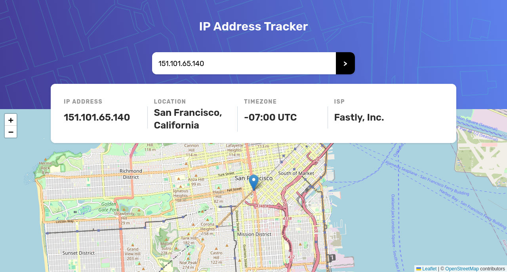

# Frontend Mentor - IP address tracker solution

This is a solution to the [IP address tracker challenge on Frontend Mentor](https://www.frontendmentor.io/challenges/ip-address-tracker-I8-0yYAH0). Frontend Mentor challenges help you improve your coding skills by building realistic projects. 

## Table of contents

- [Frontend Mentor - IP address tracker solution](#frontend-mentor---ip-address-tracker-solution)
  - [Table of contents](#table-of-contents)
  - [Overview](#overview)
    - [The challenge](#the-challenge)
    - [Screenshot](#screenshot)
    - [Links](#links)
  - [My process](#my-process)
    - [Built with](#built-with)
  - [Author](#author)
  - [Acknowledgments](#acknowledgments)

## Overview

### The challenge

Users should be able to:

- View the optimal layout for each page depending on their device's screen size
- See hover states for all interactive elements on the page
- See their own IP address on the map on the initial page load
- Search for any IP addresses or domains and see the key information and location

### Screenshot

### Links

- Solution URL: [Frontend Mentor](https://your-solution-url.com)
- Live Site URL: [Vercel](https://ip-tracker-pied-seven.vercel.app/)

## My process

### Built with

- Semantic HTML5 markup
- CSS custom properties
- Flexbox
- CSS Grid
- Mobile-first workflow
- [React](https://react.dev/) - JS library
- [LeafletJS](https://leafletjs.com/) - Mapping API
- [IP Geolocation API by IPify](https://geo.ipify.org/)

## Author

- Website - [Fred Robins](https://zenitsuAg.github.io/portfolio)
- Frontend Mentor - [@zenitsuAg](https://www.frontendmentor.io/profile/zenitsuAg)
- Twitter - [@r9_freddy](https://www.twitter.com/r9_freddy)

## Acknowledgments

- I give thanks to you, God Almighty for your grace and continuous support. Without you Lord Jesus, I wouldn't have come this far.
